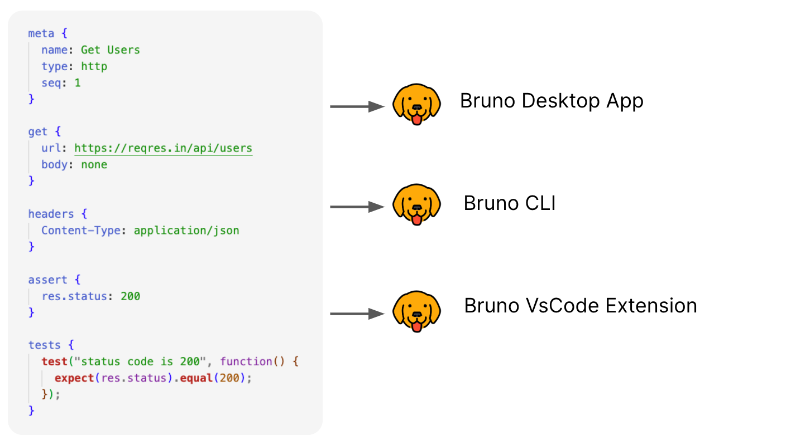

<br />


### Rebase — Git-Enhanced API Client

> A fork of [Bruno](https://github.com/usebruno/bruno) focused on making Git workflows intuitive and automatic inside the app.

Rebase is an open-source API client that stores your collections directly on your filesystem using plain text (`.bru` files), making them naturally compatible with Git.

This fork builds on Bruno's foundation by exposing and connecting the Git utilities already present in the backend — adding auto-pull, push/pull controls, and a dedicated Git panel — all without requiring a paid edition.

---

## What's different in Rebase

### Auto-pull on startup
When Rebase opens a collection that has a Git repository configured, it automatically runs `git pull --no-rebase` in the background.

- Success → green toast notification
- Failure (no connection, conflicts, etc.) → warning toast with a link to the Git tab for manual action

### Git controls in the collection context menu
Right-click any collection in the sidebar to access:
- **Git Pull** — pull latest changes from remote
- **Git Push** — push local commits to remote

These options only appear if the collection has a Git repository detected.

### Git tab in Collection Settings
A new **Git** tab is available in each collection's settings (only shown when a Git repo is present). It displays:

| Info | Description |
|------|-------------|
| Repository name | Detected from the remote URL |
| Current branch | Active branch |
| Ahead / Behind | Commits ahead or behind the remote |
| Remote URL | The configured remote |
| Local path | Filesystem path to the repo root |

Available actions:
- **Git Pull** — standard pull
- **Git Push** — push commits
- **Force Pull** — `git fetch` + `git reset --hard origin/<branch>` (requires explicit confirmation; only affects tracked files — `.gitignore`d files like `.env` are safe)
- **Refresh** — reload Git status

---

## Features (from Bruno core)

### Run across multiple platforms
 <br /><br />

### Built for Git collaboration
Collections live on your filesystem — use any version control system you prefer. Rebase makes the Git side of that seamless.

 <br /><br />

---

## Building from source

```sh
# Install dependencies
npm install

# Start in development mode
npm run dev

# Build installer (Windows x64)
npm run build
```

The installer will be generated at `packages/bruno-electron/out/`.

---

## Git authentication

For push/pull to work without password prompts, the repository needs credentials configured:

- **SSH**: use a URL like `git@github.com:user/repo.git`
- **HTTPS with credential manager**: `git config --global credential.helper manager`
- **Token in URL**: `https://TOKEN@github.com/user/repo.git`

---

## Trademark

**Bruno** is a trademark held by [Anoop M D](https://www.helloanoop.com/).
The logo is sourced from [OpenMoji](https://openmoji.org/library/emoji-1F436/). License: CC [BY-SA 4.0](https://creativecommons.org/licenses/by-sa/4.0/)

---

## License

Rebase is a fork of [Bruno](https://github.com/usebruno/bruno), originally licensed under [MIT](license.md).

Modifications and additions in this fork are also distributed under the MIT License.

Original copyright: © 2022 Anoop M D, Anusree P S and Contributors.
